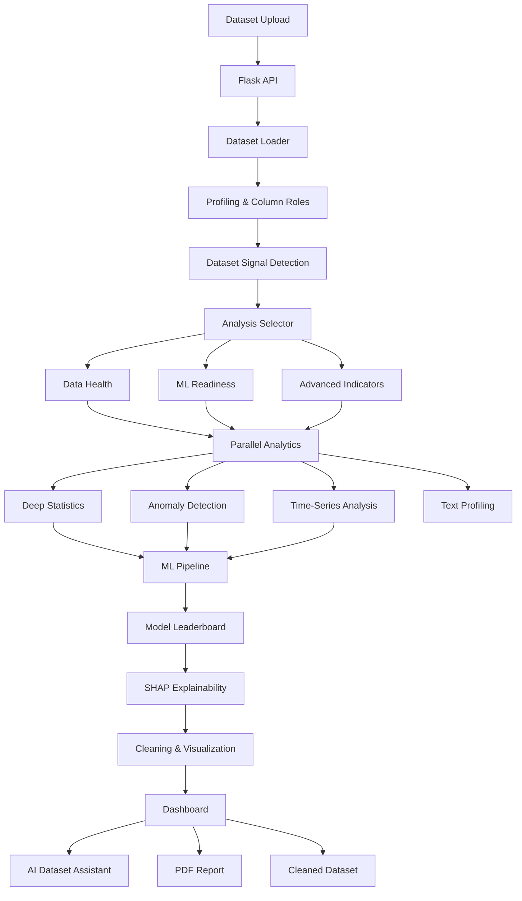

# 🔬 DataLens AI

> **Read the signal in your data.**

**DataLens AI** is an AI-powered automated dataset analysis platform that transforms raw datasets into structured, evidence-backed insights.

Upload a dataset and DataLens AI automatically performs data profiling, quality analysis, anomaly detection, statistical analysis, ML-readiness assessment, visualization, model benchmarking, explainability, dataset drift detection, and AI-assisted interpretation.

🌐 **Live Demo:** https://data-lens-ai-chi.vercel.app

---

## ✨ Features

### 📊 Automated Exploratory Data Analysis

DataLens AI automatically inspects your dataset and generates:

* Dataset shape and metadata
* Column type and role detection
* Missing-value analysis
* Duplicate detection
* Numerical distributions
* Correlation analysis
* Outlier detection
* Statistical summaries
* Dataset-level signals
* Automatically selected analyses

---

### 🩺 Data Health Score

The system evaluates the overall quality of the uploaded dataset based on indicators such as:

* Missing values
* Duplicate records
* Data consistency
* Feature quality
* Cardinality
* Potential outliers
* Structural issues

This produces an easy-to-understand **dataset health assessment** before the data is used for machine learning.

---

### 🤖 ML Readiness Analysis

DataLens AI evaluates whether a dataset is suitable for machine learning.

It identifies potential problems including:

* Missing data
* High-cardinality columns
* Constant or near-constant features
* Class imbalance
* Possible identifiers
* Data-type issues
* Feature quality problems
* Target suitability

When a target column is selected, additional ML analysis becomes available.

---

### 🧠 Automated Machine Learning Analysis

When a target column is provided, DataLens AI can automatically run a model evaluation pipeline.

The ML stack includes tools such as:

* Scikit-learn
* XGBoost
* LightGBM
* Imbalanced-learn
* Optuna

The platform can generate a **model leaderboard** and identify the best-performing baseline model.

---

### 🔍 Explainable AI

DataLens AI includes model explainability support using **SHAP**.

After identifying a winning model, the platform can analyze feature influence and generate feature-importance explanations to help understand why the model produces its predictions.

---

### 🚨 Ensemble Anomaly Detection

Instead of depending on a single anomaly detector, DataLens AI includes an anomaly-analysis pipeline designed to identify suspicious or unusual records using multiple detection techniques.

The platform uses libraries including **PyOD** and Scikit-learn to support advanced anomaly analysis.

---

### 📈 Deep Statistical Analysis

For supported analysis modes, DataLens AI performs additional statistical analysis including:

* Distribution analysis
* Correlation analysis
* Statistical relationships
* Advanced indicators
* Feature-level statistics
* Dataset-level patterns

Libraries such as **SciPy**, **Statsmodels**, and **Pingouin** are used for deeper statistical analysis.

---

### ⏱️ Time-Series Detection

DataLens AI automatically searches for temporal structure inside datasets.

If relevant date/time information is found, the analysis pipeline can perform additional time-series-oriented analysis.

---

### 📝 Text Column Profiling

Datasets containing textual columns can also be inspected separately.

DataLens AI identifies textual features and performs dedicated profiling instead of treating all columns as ordinary categorical variables.

---

### 🔄 Dataset Drift Analysis

DataLens AI can compare two datasets to detect changes between them.

For example:

```text
Training Dataset
       │
       ▼
   DataLens AI
       ▲
       │
Production Dataset
```

The system can compare a **reference dataset** with a **current dataset** and identify distributional or structural drift.

A single time-based dataset can also be divided into older and newer portions for self-comparison.

---

### 💬 AI Dataset Assistant

After analyzing a dataset, users can ask natural-language questions about it.

Examples:

```text
What are the biggest problems in this dataset?

Which features appear most important?

Is this dataset suitable for machine learning?

What anomalies should I investigate?

What should I clean before training a model?
```

DataLens AI provides an agent-based Q&A system that uses the actual dataset analysis as context.

The agent supports both:

* Fast response mode
* Full agent workflow

The full workflow can use multiple reasoning stages to construct an answer.

---

### 🧠 Local LLM Support with Ollama

DataLens AI supports **Ollama**, allowing AI analysis to run with local models.

The default installation can configure models such as:

```text
qwen3:4b
nomic-embed-text
```

The application is designed to degrade gracefully if the LLM service is unavailable, allowing the core analytical pipeline to continue functioning.

OpenRouter can also be configured as an additional AI provider.

---

### 📑 AI-Generated Reports

AI-assisted dataset reports can be generated on demand after the main analysis completes.

This keeps the initial analytics pipeline responsive while allowing deeper narrative interpretation when requested.

---

### 📄 PDF Report Generation

DataLens AI can automatically generate downloadable PDF analysis reports containing the results of the dataset analysis.

PDF generation is handled separately from the primary request so expensive report generation does not block the main analytical workflow.

---

### 🧹 Cleaned Dataset Export

The system automatically performs dataset-cleaning operations and can provide a cleaned CSV file for download.

This allows users to move directly from:

```text
Raw Dataset
     ↓
DataLens AI
     ↓
Analysis + Cleaning
     ↓
Cleaned Dataset
```

---

## 📁 Supported File Formats

DataLens AI currently supports:

| Format          | Extension |
| --------------- | --------- |
| CSV             | `.csv`    |
| TSV             | `.tsv`    |
| Microsoft Excel | `.xlsx`   |
| Microsoft Excel | `.xls`    |
| JSON            | `.json`   |

CSV files are loaded using multiple encoding fallbacks to improve compatibility with real-world exported datasets.

---

## ⚡ Analysis Modes

DataLens AI provides multiple analysis levels:

```text
Quick
  │
  ├── Standard
  │
  ├── Deep
  │
  └── Research
```

### Quick

Designed for fast structural inspection and essential dataset diagnostics.

### Standard

Runs the main analytical pipeline including deeper statistical and anomaly analysis.

### Deep

Provides additional computational analysis for more detailed exploration.

### Research

Designed for the most comprehensive analysis workflow available in the platform.

---

## 🏗️ Architecture



---

## 🧩 Application Architecture

DataLens AI contains three primary interfaces.

### React Dashboard

Modern frontend dashboard built with:

* React
* TypeScript
* Vite
* Tailwind CSS
* Highcharts
* Framer Motion
* TanStack React Query

Default development URL:

```text
http://127.0.0.1:5173
```

---

### Flask Backend

The Flask application provides the main analysis API and manages:

* Dataset uploads
* Analysis execution
* Dataset Q&A
* AI reports
* Drift comparison
* Cleaned dataset downloads
* PDF reports
* Health checks

Default URL:

```text
http://127.0.0.1:5055
```

Health endpoint:

```text
http://127.0.0.1:5055/api/health
```

---

### Streamlit Console

A separate Streamlit interface provides a visual step-by-step console for inspecting DataLens AI.

Default URL:

```text
http://127.0.0.1:8501
```

---

## 🛠️ Technology Stack

### Backend

* Python
* Flask
* Pandas
* NumPy

### Data Science & Statistics

* SciPy
* Statsmodels
* Pingouin
* Seaborn
* Matplotlib
* Plotly
* Missingno

### Machine Learning

* Scikit-learn
* XGBoost
* LightGBM
* Imbalanced-learn
* Optuna

### Anomaly Detection

* PyOD

### Explainable AI

* SHAP

### AI

* Ollama
* Local LLMs
* OpenRouter support
* Embedding-based retrieval

### Frontend

* React 19
* TypeScript
* Vite
* Tailwind CSS 4
* Highcharts
* Framer Motion
* TanStack React Query
* Lucide React

### Reporting

* FPDF2
* Jinja2

### Additional Interface

* Streamlit

---

## 🚀 Getting Started

### Prerequisites

Install:

* **Python 3.11+**
* **Node.js 18+**
* **npm**
* **Git**

Ollama is optional but recommended for local AI features.

---

## 1. Clone the Repository

```bash
git clone https://github.com/parthdongre/DataLens-AI.git
cd DataLens-AI
```

---

## 2. Run the Installer

On macOS or Linux:

```bash
chmod +x install.sh
./install.sh
```

The installer automatically:

1. Creates a Python virtual environment
2. Installs Python dependencies
3. Installs frontend dependencies
4. Checks critical Python libraries
5. Configures required directories
6. Optionally downloads Ollama models

To install without Ollama:

```bash
SKIP_OLLAMA=1 ./install.sh
```

---

## 3. Start DataLens AI

```bash
chmod +x run.sh
./run.sh
```

This can start:

```text
Ollama
   +
Flask Backend
   +
React / Vite Dashboard
   +
Streamlit Console
```

Open:

```text
React Dashboard:
http://127.0.0.1:5173

Streamlit Console:
http://127.0.0.1:8501

Flask API:
http://127.0.0.1:5055
```

Press `Ctrl+C` to stop the services.

---

## ⚙️ Useful Launch Options

### Skip Ollama

```bash
SKIP_OLLAMA=1 ./run.sh
```

### Skip React Frontend

```bash
SKIP_FRONTEND=1 ./run.sh
```

### Skip Streamlit

```bash
SKIP_STREAMLIT=1 ./run.sh
```

### Automatically Open the Dashboard

```bash
OPEN_BROWSER=1 ./run.sh
```

### Use the Local Ollama Model

```bash
LOCAL_MODEL=1 ./run.sh
```

### Select a Specific Ollama Model

```bash
OLLAMA_MODEL=<model-name> ./run.sh
```

---

## 🧑‍💻 Manual Installation

If you do not want to use `install.sh`:

```bash
python3 -m venv venv
source venv/bin/activate

pip install --upgrade pip
pip install -r requirements.txt
```

Install frontend dependencies:

```bash
cd frontend
npm install
cd ..
```

Start Flask:

```bash
python app.py
```

In another terminal:

```bash
cd frontend
npm run dev
```

Optionally start Streamlit:

```bash
streamlit run streamlit_app.py
```

---

## 📂 Project Structure

```text
DataLens-AI/
│
├── app.py                    # Flask backend / API
├── streamlit_app.py          # Streamlit analysis console
│
├── modules/                  # Core analysis engine
│   ├── ai_agent.py
│   ├── ai_insights.py
│   ├── anomaly_ensemble.py
│   ├── cleaner.py
│   ├── column_roles.py
│   ├── dataset_signals.py
│   ├── deep_statistics_v2.py
│   ├── drift_analysis.py
│   ├── explainability.py
│   ├── health_score.py
│   ├── loader.py
│   ├── ml_readiness.py
│   ├── model_leaderboard.py
│   ├── pipeline.py
│   ├── profiler.py
│   ├── report_generator.py
│   ├── text_profile.py
│   ├── time_series.py
│   └── visualizer.py
│
├── frontend/                 # React + TypeScript dashboard
│   ├── src/
│   │   ├── charts/
│   │   └── components/
│   ├── package.json
│   └── vite.config.ts
│
├── demo_datasets/            # Example datasets
├── uploads/                  # Uploaded datasets
├── cleaned/                  # Generated cleaned datasets
├── reports/                  # Generated PDF reports
├── static/                   # Backend static assets
├── logs/                     # Runtime logs
│
├── requirements.txt
├── install.sh
└── run.sh
```

---

## 🔬 Analysis Pipeline

The DataLens AI pipeline is organized into several phases.

### Phase 1 — Structural Understanding

```text
Dataset
   ↓
Load
   ↓
Profile
   ↓
Column Role Detection
   ↓
Dataset Signal Detection
   ↓
Analysis Selection
```

### Phase 2 — Dataset Assessment

```text
Health Score
ML Readiness
Advanced Indicators
```

### Phase 3 — Parallel Analytics

Several expensive analyses execute in parallel:

```text
Deep Statistics
Anomaly Detection
Time-Series Analysis
Text Profiling
```

### Phase 4 — ML Analysis

When a target column is available:

```text
Target Selection
      ↓
Model Leaderboard
      ↓
Winning Model
      ↓
SHAP Explainability
```

### Phase 5 — Output Generation

```text
Signal Generation
Dataset Cleaning
Chart Generation
```

### Phase 6 — AI Interpretation

```text
Analysis Results
      ↓
AI Report
      ↓
Dataset Assistant
```

---

## 🔌 API Overview

Some of the main backend endpoints include:

```text
POST /api/analyze
```

Analyze an uploaded dataset.

```text
POST /api/ask
```

Ask questions about an analyzed dataset.

```text
POST /api/ai-report
```

Generate an AI-assisted dataset report.

```text
POST /api/compare
```

Compare a reference dataset with a current dataset.

```text
POST /api/compare-self
```

Split a dataset using a date column and analyze drift between the older and newer sections.

```text
GET /api/health
```

Check backend and AI-service status.

```text
GET /download-cleaned/<dataset_id>
```

Download the cleaned dataset.

```text
GET /download-report/<dataset_id>
```

Download the generated PDF report.

---

## 🎯 Project Goal

Data analysis often requires repeatedly moving between different tools for:

* Data cleaning
* Statistical analysis
* Visualization
* Anomaly detection
* Machine learning
* Explainability
* Dataset monitoring
* Reporting

**DataLens AI aims to combine these stages into one automated workflow.**

Instead of only generating charts, the platform attempts to understand the structure and quality of a dataset, select appropriate analyses, identify potential problems, evaluate machine-learning suitability, and explain the results through an interactive AI interface.

---

## 🔮 Future Improvements

Potential improvements include:

* Support for larger datasets
* Database connections
* Real-time production data monitoring
* Persistent analysis history
* Multi-dataset projects
* Automatic target-column recommendation
* More advanced AutoML
* Additional drift-detection algorithms
* Model deployment workflows
* Collaborative reports
* Cloud-hosted AI models
* Improved RAG over dataset metadata
* Exportable analysis notebooks

---

## 🤝 Contributing

Contributions, suggestions, and bug reports are welcome.

1. Fork the repository
2. Create a new branch

```bash
git checkout -b feature/my-feature
```

3. Make your changes
4. Commit them

```bash
git commit -m "Add my feature"
```

5. Push your branch

```bash
git push origin feature/my-feature
```

6. Open a Pull Request

---

## 👨‍💻 Author

**Parth Dongre**

GitHub: [@parthdongre](https://github.com/parthdongre)

---

## ⭐ Support

If you find DataLens AI useful, consider giving the repository a ⭐.

It helps support continued development of the project.

---

<p align="center">
  <b>DataLens AI</b><br>
  Read the signal in your data.
</p>
